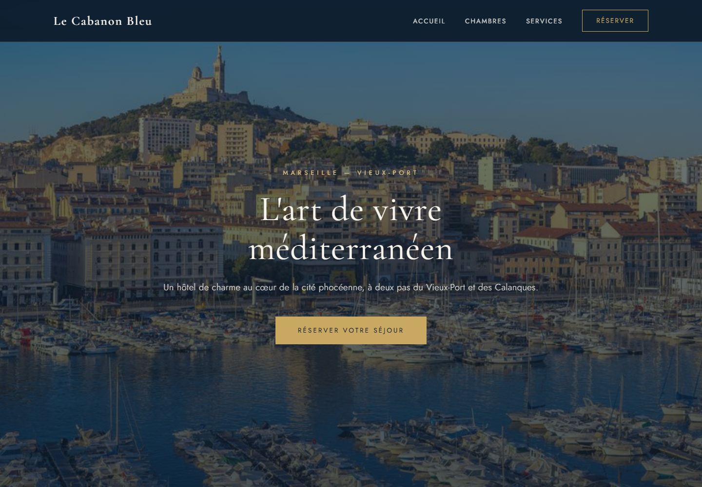
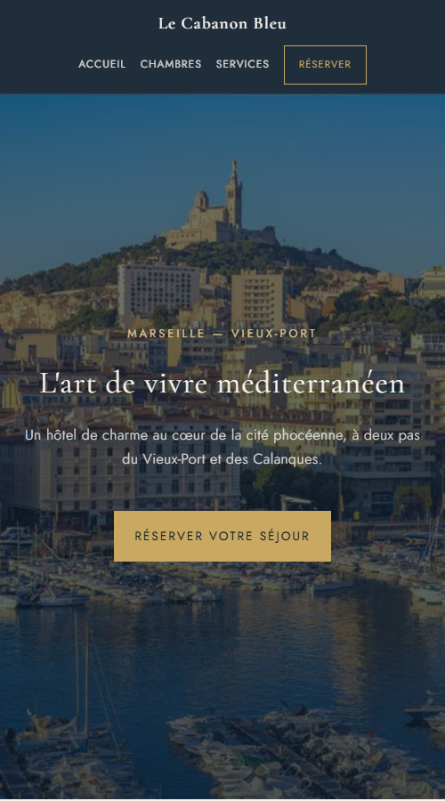

# Le Cabanon Bleu — Site vitrine d’un hôtel fictif

## Texte court pour le portfolio

Le Cabanon Bleu est un projet personnel de site vitrine pour un hôtel fictif à Marseille. Son identité visuelle associe bleu nuit, doré et ivoire à une photographie du Vieux-Port. Le site propose une découverte des chambres et des services, puis un parcours de réservation de démonstration, adapté aux ordinateurs, tablettes et téléphones.

## Objectif

Créer une expérience de visite claire et soignée, de la découverte de l’établissement jusqu’à la simulation d’une demande de réservation.

## Technologies

HTML, CSS et JavaScript natif, sans framework ni serveur applicatif. Mise en page avec Grid et Flexbox, adaptations par media queries et typographies Google Fonts.

## Fonctionnalités et choix de réalisation

- Cinq pages : accueil, trois fiches de chambres et formulaire de réservation.
- Navigation et grilles adaptées aux petits écrans.
- Bannière fixe sur ordinateur et fond défilant sur téléphone.
- Validation des champs obligatoires, de l’adresse email et de l’ordre des dates du séjour.
- Confirmation de démonstration : aucune demande envoyée ni donnée de formulaire enregistrée par le site.
- Accès direct au contenu, repères de focus au clavier et respect de la préférence de réduction des animations.
- Palette de texte ajustée pour améliorer la lisibilité sur les fonds clairs et sombres.

## Captures à joindre

## Nature du projet

Projet de démonstration pour portfolio. L’établissement, les coordonnées et les offres sont fictifs. Il n’y a ni réservation réelle, ni paiement, ni envoi d’email. Ce projet illustre une réalisation front-end ; il ne revendique pas un audit complet d’accessibilité.
